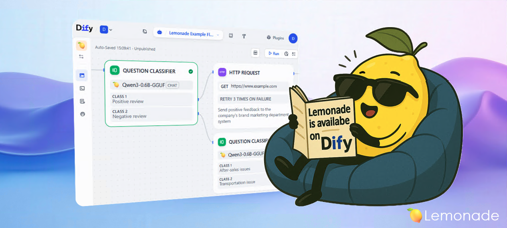

## Overview



[Lemonade](https://github.com/lemonade-sdk/lemonade) is a client inference framework (Windows, Linux) designed for seamless deployment of large language models (LLMs) with NPU and GPU acceleration. It supports models like Qwen, Llama, DeepSeek, and more, optimized for different hardware configurations.

Lemonade enables local execution of LLMs, providing enhanced data privacy and security by keeping your data on your own machine while leveraging hardware acceleration for improved performance.

Dify integrates with Lemonade Server to provide LLM, text embedding, and reranking capabilities for models deployed locally.

## Configure

#### 1. Install and Run Lemonade Server

Visit the [Lemonade's Website](https://lemonade-server.ai/) to download the Lemonade Server client for your system.

To start Lemonade server, simply run:

```bash
lemonade-server serve
```
> Note: If you installer from source use `lemonade-server-dev` instead

Once started, Lemonade will be accessible at `http://localhost:8000`.


#### 2. Install Lemonade Plugin in Dify

Go to the [Dify marketplace](https://marketplace.dify.ai/plugins/langgenius/lemonade) and search for "Lemonade" to download the official plugin.


#### 4. Integrate Lemonade Server in Dify

In `Settings > Model Providers > Lemonade`, fill in the following configuration:


**Basic Configuration:**
- **Model Name**: `Qwen3-8B-GGUF` (or your chosen model)
- **API Endpoint URL**: `http://127.0.0.1:8000`
  - Enter the base URL where the Lemonade Server service is accessible
  - If Dify is deployed using Docker, consider using the local network IP address, e.g., `http://192.168.1.100:8000` or `http://host.docker.internal:8000`

**Model Configuration:**
- **Model Context Size**: `4096` (adjust based on your model's specifications)
  - The maximum context length of the model. Common values: 4096, 8192, 32768
  - Check the model's documentation for optimal context size
- **Agent Thought Support**: Select "Support" if your model supports reasoning chains
- **Vision Support**: Select "Support" if your model supports image understanding (multimodal capabilities)

**Advanced Settings:**
- **Model Type**: Choose from `llm`, `text-embedding`, or `rerank` based on your use case
- **Streaming**: Enable for real-time response streaming
- **Temperature and Top-p**: Adjust for response creativity and randomness

#### 6. Model Type Specific Configuration

**For LLM (Chat/Completion) Models:**
```
Model Name: Qwen3-8B-GGUF
Model Type: llm
Context Size: 8192
Agent Thought: Support (if applicable)
Vision Support: Not Support (unless using multimodal model)
```

**For Text Embedding Models:**
```
Model Name: [Embedding model name]
Model Type: text-embedding
Context Size: 512 (typical for embeddings)
```

**For Rerank Models:**
```
Model Name: [Rerank model name]
Model Type: rerank
Context Size: 1024 (typical for reranking)
```

#### 7. Testing Your Configuration

**Install a model using the CLI:**


**Or use the Model Management GUI:**
- Open your web browser and navigate to `http://localhost:8000`
- Click on the "Model Management" tab
- Browse available models and install them with one click

For a complete list of supported models, visit [Lemonade Server Models](https://lemonade-server.ai/docs/server/server_models/).

#### 3. Popular Model Recommendations

**🔥 Hot Models (Recommended):**
- `Qwen3-30B-A3B-Instruct-2507-GGUF` - Advanced general-purpose model
- `Qwen3-Coder-30B-A3B-Instruct-GGUF` - Specialized for coding tasks
- `gpt-oss-120b-GGUF` - Large reasoning model
- `GLM-4.5-Air-UD-Q4K-XL-GGUF` - Optimized reasoning model

**For different hardware configurations:**
- **NPU acceleration**: `Qwen-2.5-7B-Instruct-NPU`, `DeepSeek-R1-Distill-Llama-8B-NPU`
- **CPU-only**: `Qwen2.5-0.5B-Instruct-CPU`, `Phi-3-Mini-Instruct-CPU`
- **Hybrid**: Various models optimized for mixed hardware setups


After configuration, click "Save" and test the model:

1. Verify the connection is successful (green indicator)
2. Test with a simple prompt in the Dify interface
3. Check response quality and latency

#### 8. Troubleshooting

**Common Issues:**

- **Connection Failed**: Ensure Lemonade Server is running on the specified port
- **Model Not Found**: Verify the model name matches exactly with installed models
- **Out of Memory**: Try a smaller model or adjust system resources
- **Slow Performance**: Consider using NPU or GPU accelerated models if available

**Check Model Status:**
```bash
lemonade-server list
```

**View Server Logs:**
Check the Lemonade Server console output for detailed error messages.

**Docker Network Issues:**
If using Docker, ensure proper network configuration:
- Use `host.docker.internal:8000` on macOS/Windows
- Use the Docker host IP address on Linux

#### 9. Performance Optimization

**Hardware-Specific Models:**
- Use **NPU models** for AMD Ryzen AI processors
- Use **Hybrid models** for mixed CPU/GPU setups
- Use **GGUF models** for general-purpose deployment
- Use **CPU models** for systems without dedicated AI hardware

**Model Size Selection:**
- Smaller models (0.5B-8B): Faster inference, lower memory usage
- Medium models (14B-30B): Balanced performance and quality
- Large models (70B+): Highest quality, requires significant resources

#### 10. Additional Resources

For more detailed information:
- [Lemonade Server Documentation](https://lemonade-server.ai/docs/)
- [Lemonade Server GitHub Repository](https://github.com/lemonade-sdk/lemonade)
- [Supported Models List](https://lemonade-server.ai/docs/server/server_models/)
- [Dify's Official Documentation](https://docs.dify.ai/development/models-integration/)

Click "Save" to use the model in your application after verifying that there are no errors.

The integration method for Embedding and Rerank models is similar to LLM, just change the model type accordingly in the configuration.